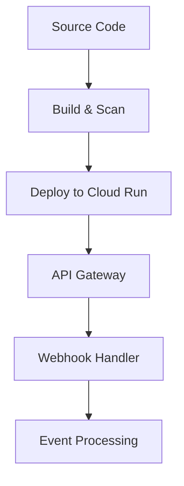

# ons-github-app

## Overview

A GitHub App backend for secure webhook processing and automation, deployed on Google Cloud Run. The app validates GitHub webhook signatures, manages installation tokens, and routes events for further processing. Infrastructure is provisioned with Terraform, and security is enforced via pre-commit hooks and CI scans.

If you want to replicate the full setup (GCP remote state, Terraform apply phases, GitHub App creation, deploy + verification), follow the end-to-end tutorial in `docs/tutorial/README.md`.

## Features

- FastAPI-based webhook handler (`/webhooks/github`)
- Signature verification for GitHub webhooks
- JWT-based GitHub App authentication
- Google Cloud Run deployment (Dockerized)
- Terraform-managed GCP resources (Cloud Run, Artifact Registry, API Gateway)
- Security scanning (Checkov, Trivy) via CI
- Pre-commit hooks for secret/key detection

## Installation

1. Clone the repo and create a Python virtual environment:

   ```bash
   python3 -m venv .venv
   source .venv/bin/activate
   pip install -r requirements.txt
   ```

2. Install pre-commit hooks:

   ```bash
   pip install pre-commit
   pre-commit install
   ```

3. Set required environment variables:
   - `GITHUB_APP_ID`
   - `GITHUB_PRIVATE_KEY_FILE`
   - `GITHUB_WEBHOOK_SECRET_FILE`
   - `GITHUB_ACCEPTED_EVENTS` (optional, comma-separated)

## Usage

- Run locally:

  ```bash
  uvicorn src.app:app --host 0.0.0.0 --port 8080
  ```

- Health check endpoint: `GET /healthz`
- Webhook endpoint: `POST /webhooks/github`

## Deployment

- Canonical workflow: Terraform-managed deployment (Cloud Run + API Gateway) with Artifact Registry images and secrets mounted from Secret Manager.
   - Start here: `docs/tutorial/README.md`
   - Terraform module docs: `infra/terraform/README.md`

- Optional helpers:
   - `deploy.sh` can build and push a container image to Artifact Registry.
   - `cloudbuild.yaml` can build and push an image in Cloud Build.
   These helpers intentionally do not provision infra; Terraform remains the source of truth.

## Security

- Pre-commit hooks scan for secrets and large files.
- CI workflow runs Checkov and Trivy scans on every push/PR.
- Sensitive values are managed via Secret Manager (Cloud Run) or local secret files (development) and never committed.

## Project Workflow



## License

The code is released under the MIT License. Documentation is © Crown copyright and available under the Open Government 3.0 license.
