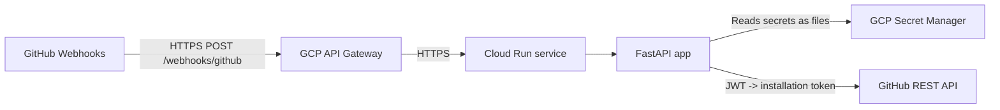

# Architecture overview (ons-github-app)

This folder documents how `ons-github-app` is put together, why key design decisions were made, and what the security posture looks like.

Audience:

- Technical architects (cloud topology, IaC, operational model)
- Security colleagues (threat model, key controls, “what could go wrong”)
- Interested engineers (how the pieces fit)

If you want to *deploy* the system end-to-end, start with the setup tutorial at `docs/tutorial/README.md`.

## What the system does (today)

`ons-github-app` is a small FastAPI service that receives GitHub webhooks at `POST /webhooks/github`.

Current demo behavior:

- Verify webhook authenticity using `X-Hub-Signature-256` (HMAC-SHA256)
- For `pull_request` events with `action=opened`, post a comment back to the PR as the GitHub App

## High-level topology

Inbound webhook traffic flows through API Gateway to Cloud Run.

Key components:

- **FastAPI app** (runtime): `src/app.py`, `src/webhook.py`, `src/github_app.py`, `src/config.py`
- **Cloud Run** (compute): runs the container and scales based on request volume
- **API Gateway** (ingress): routes `POST /webhooks/github` to Cloud Run
- **Secret Manager** (secrets): stores the GitHub App private key and webhook secret
- **Artifact Registry** (images): stores container images deployed to Cloud Run
- **Terraform** (IaC): declares and provisions all the above

## Endpoints

- `GET /healthz` — liveness/health endpoint
- `POST /webhooks/github` — GitHub webhook receiver

## Data flow: webhook verification and response

1. GitHub sends a webhook payload and includes `X-Hub-Signature-256: sha256=<digest>`
2. The app reads the raw request body bytes
3. The app recomputes the expected digest using the shared webhook secret
4. The app compares digests using a constant-time comparison
5. If valid and the event is accepted, the app executes the handler (e.g. post PR comment)

## Secrets and configuration model

This repo documents a single recommended approach:

- Secrets are **stored as files**
- The app receives **non-secret** environment variables that point at those files:
  - `GITHUB_PRIVATE_KEY_FILE`
  - `GITHUB_WEBHOOK_SECRET_FILE`

Local development:

- Keep secret files under `./local-secrets/` (ignored by git)

Cloud Run:

- Terraform provisions the Secret Manager *secret containers*
- Secret *values* are added outside Terraform using `gcloud secrets versions add ...`
- Terraform mounts the secrets into the container filesystem, and sets the `*_FILE` env vars

## Infrastructure (Terraform) shape

This repo is designed for a two-phase apply, described in `docs/tutorial/README.md`:

1. **Bootstrap/shared infra** (no image)
   - APIs enabled
   - service account
   - Artifact Registry
   - Secret Manager secrets (containers only)

2. **Deploy** (image provided)
   - Cloud Run service
   - API Gateway
   - IAM binding granting API Gateway permission to invoke Cloud Run

## Operational notes

- Logging: the app logs to stdout/stderr; on Cloud Run this lands in Cloud Logging.
- Scaling: Cloud Run scales horizontally with incoming requests. (No explicit autoscaling tuning is configured in Terraform today.)
- CI: GitHub Actions runs Checkov and Trivy filesystem scans; locally, `pre-commit` includes detect-secrets and terraform checks.

## Design decisions (where to read more)

- See `docs/architecture/design-decisions.md` for the short “why we chose X” list.
- See `docs/architecture/security.md` for a security-focused view (threats, controls, and open gaps).
